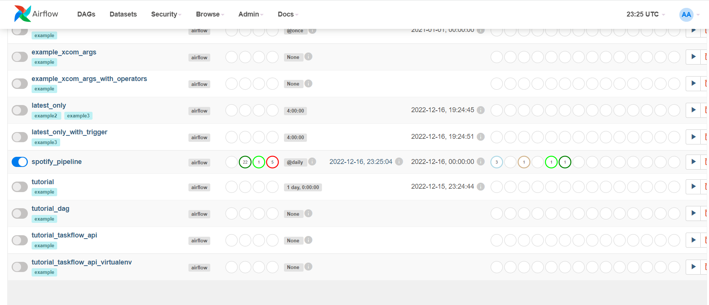
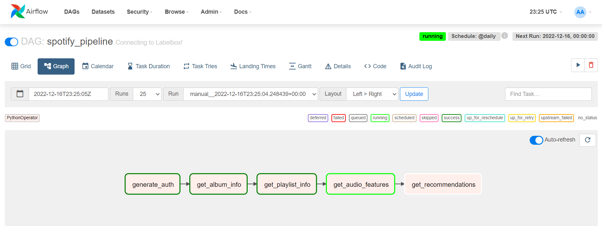
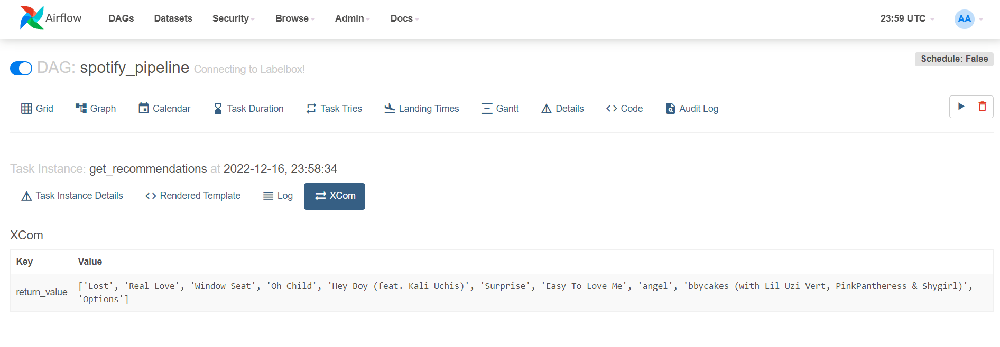
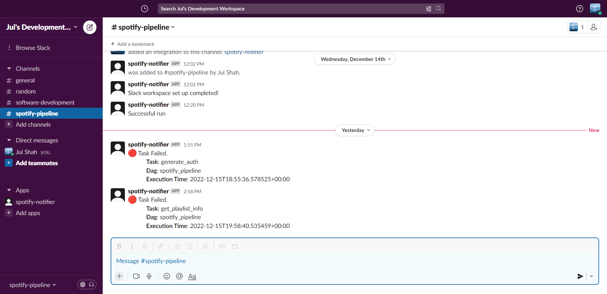

# Spotify ETL Pipeline

This pipeline was designed using Apache Airflow and Docker to programatically generate song recommendations using the Spotify API. It generates the necessary authorization details needed and then extracts data on my favourite playlists, albums, and tracks on Spotify. This information is then processed to identify key features, such as the artists of these tracks, and the audio features of these tracks, such as its tempo, energy and 'danceability'.

Using these details, I specified seed artists, genres, tracks, and audio features to generate song recommendations for myself, with a bias towards songs with higher valence and 'danceability' scores. I was pleasantly suprised with the outcome and have loved many of songs that I was recommended.

Since I don't have a subscription to any cloud computing services, I wasn't able to utilize a proper data lake and data warehouse to store the data, but it's definitely something I'd love to do in the future to futher scale this pipeline.

A list of some of the songs I was recommended:

This pipeline also automatically sends alerts to Slack upon encountering any failures or errors:

 

### Set-up

Requires Docker Desktop.

Steps:
Run the following commands on your terminal.

1. `docker compose build`
2. `docker compose up`

View state of container, `docker ps` (wait till you see healthy) .  
View the UI in a browser, go to `localhost:8080` .  
When you're done, `docker-compose down` and close Docker Desktop .
